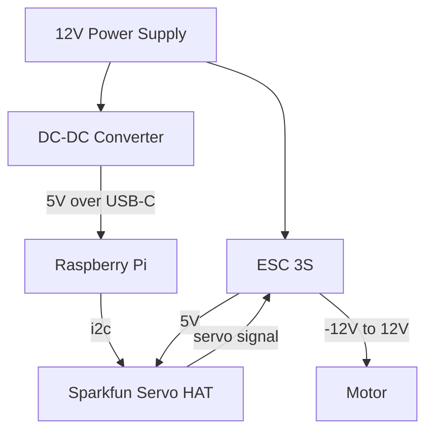

# ESC Motor Control

Presently we have 3 different ESC motor controllers:
 * [ESC 3S Controller](https://www.amazon.com/dp/B083WDRP24?ref=ppx_yo2ov_dt_b_fed_asin_title) -([manual](https://claude.site/artifacts/4e01515b-827a-4522-a821-e2605cfc380e))
 * [Roboclaw 2x7A](https://www.basicmicro.com/roboclaw-2x7a-motor-controller_p_55.html)
 * [Hiletgo 10A PWM](https://www.amazon.com/gp/product/B00QVONO20/ref=ppx_yo_dt_b_search_asin_title?ie=UTF8&psc=1)

All of these require PWM input. The goal is variable speed motor output.

# PWM Generators

* Raspberry PI HW control
* Raspberry PI SW generated
* [Sparkfun Servo pHat](https://learn.sparkfun.com/tutorials/pi-servo-phat-v2-hookup-guide/hardware-overview)
* [PCA9685 i2c board](https://www.amazon.com/gp/product/B09WK4V4BJ/ref=ppx_yo_dt_b_asin_title_o00_s00?ie=UTF8&psc=1) (untested)

# ESC Issues

* ESC 3S Controller (works)
  * As a 3S, its max voltage is supposed to be 11 volts. While it works at 14-volts, there is a risk here.
    * This could create heat issues - especially at high load.
  * It seems to **REALLY** want the PWM to be generated with the voltage it supplies back to the servo.
  * The max voltage it supplies back to the servo is 1A. This cannot be used to power the pi.
  * Probably needs sealed switch to be flipped for proper operation.
* Roboclaw 2x7A
  * Requires windows software for configuration.
  * Expensive.
* Hiletgo 10A PWM
  * Designed for arduino and appears to need a number of additional electronic components.
  * Large and a bit exposed.

# PWM Issues

* Raspberry PI
  * HW PWM
    * Will only send 3.3v (can a pull up resistor be used?)
    * There are only 2 HW PWMs (but might be more on PI 4 & 5, and HW PWMs might be able to control multiple pins?)
  * SW PWM
    * This requires some timing that is difficult to maintain in SW (maybe) -- especially if other software is added later, etc.
      * SW PWM did seem to confuse the ESC 3S enough to drive it even at 3.3v. It is possible there is still a gap in understanding.
* Sparkfun Servo HAT (works)
  * The HAT does not allow use of other GPIO pins.
  * It is more expensive than straight PCA9685 boards.

# Code

Various AIs have helped write the code in this directory. Final software selection and HW configuration will be decided and these examples need more documentation.

# Current working solution

