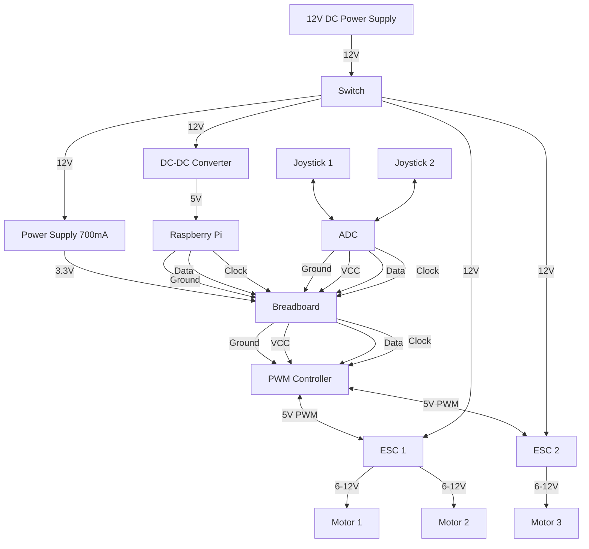

# Variable Motor Prototype

## Libraries

These are the primary modules in use. `pip list` might show more.

* adafruit-circuitpython-ads1x15
* adafruit-circuitpython-servokit
* adafruit-circuitpython-pca9685

## Circuit Diagram

## Notes

### 2024-11-26 Eric Brown

#### Sparkfun servo hat

I started today having only a sparkfun servo hat (which uses a 9685) and
exposes i2c. I wired up the ADS1115 via i2c off the sparkfun qwiic connector
and verified I could feed its data into Adafruit's ServoKit to control my
ESC and motor.

#### PCA9685

Once the 9685 was delived, I removed the servo hat and wired this directly.
The code for the servo hat did not work (and I did not dig into why). It
should have worked.

I found example code for the 9685 board at adafruit and that code worked
better (and/or was more understandable). The example code is in
`pca9685_servo.py` and is where integration should continue moving forward.
The file `control_9685.py` needs modification to use whatever code is in
`pca9685_server.py` instead of the servokit code.
